<!-- Header Banner -->
<div align="center">
  
</div>

<!-- Typing Animation -->
<div align="center">
  <a href="https://git.io/typing-svg">
    
  </a>
</div>

<br/>

### 🐍 About Me

```python
class AliHasnain:
    def __init__(self):
        self.name = "Ali Hasnain"
        self.role = "Full Stack & AI Developer"
        self.location = "Pakistan"
        self.interests = ["Multi-Agent AI", "React/Next.js", "FastAPI", "DevOps"]
        self.current_project = "Validator-AI"
        
    def get_status(self):
        return "Coding, learning, and building high-performance agentic systems."
```

---

### 🛠️ Tech Arsenal

#### 💻 Languages & Frameworks
<p align="left">
  <a href="https://skillicons.dev">
    
  </a>
</p>

#### 🧰 Tools & Databases
<p align="left">
  <a href="https://skillicons.dev">
    
  </a>
</p>

---

### 🚀 Featured Projects

<table width="100%">
  <tr>
    <td width="50%" valign="top">
      <h4>🔍 <a href="https://github.com/aliHasnainme/validator-ai">Validator-AI</a></h4>
      <p>A multi-agent system designed for automated code validation, compilation checks, and self-healing error resolution.</p>
      
      
      
    </td>
    <td width="50%" valign="top">
      <h4>🛒 <a href="https://github.com/aliHasnainme/local-mart">Local-Mart</a></h4>
      <p>A modern e-commerce marketplace platform built to connect local merchants with consumers efficiently.</p>
      
      
      
    </td>
  </tr>
</table>

---

### 📊 GitHub Stats & Performance

<div align="center">
  <table border="0">
    <tr>
      <td width="50%" align="center">
        <!-- Self-updating Stats Card (generated by GitHub Action) -->
        
      </td>
      <td width="50%" align="center">
        <!-- Streak Stats (real-time external API call) -->
        
      </td>
    </tr>
    <tr>
      <td width="50%" align="center">
        <!-- Self-updating Top Languages (generated by GitHub Action) -->
        
      </td>
      <td width="50%" align="center">
        <!-- GitHub Activity Graph -->
        
      </td>
    </tr>
  </table>
</div>

---

### 🎮 Code Eating Snake Grid
<div align="center">
  <!-- Dynamic Contribution Grid Snake (generated by Snake GitHub Action) -->
  
</div>

---

### 📈 Profile Activity Summary
<div align="center">
  
  
  
  
  
</div>

<br/>

<!-- Footer Wave & Views Counter -->
<div align="center">
  
  <br/><br/>
  
</div>
